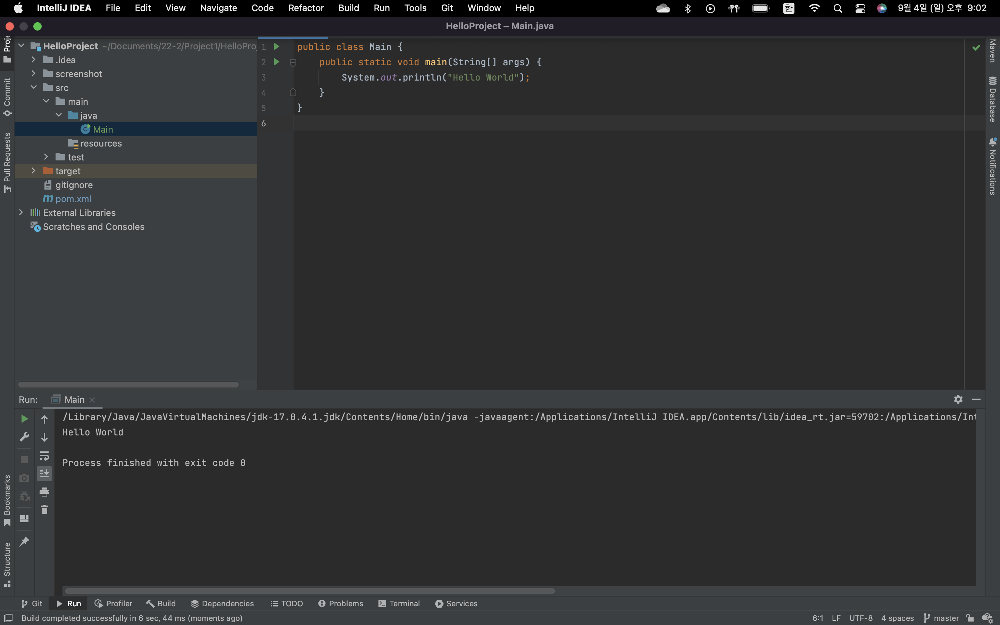
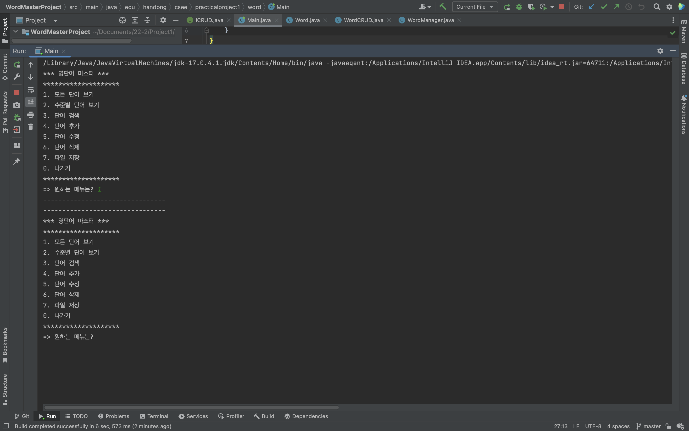
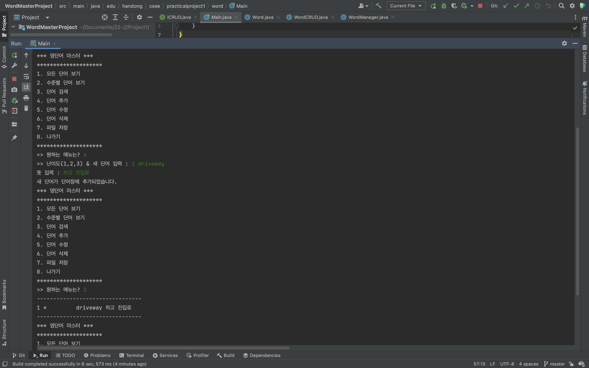
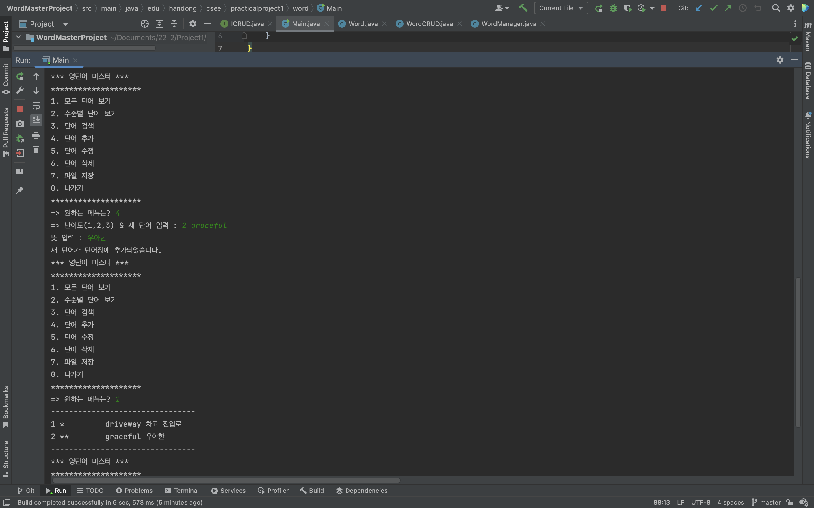
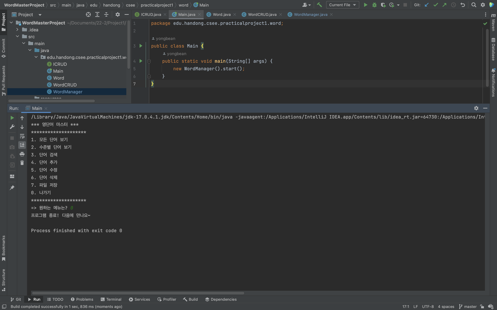
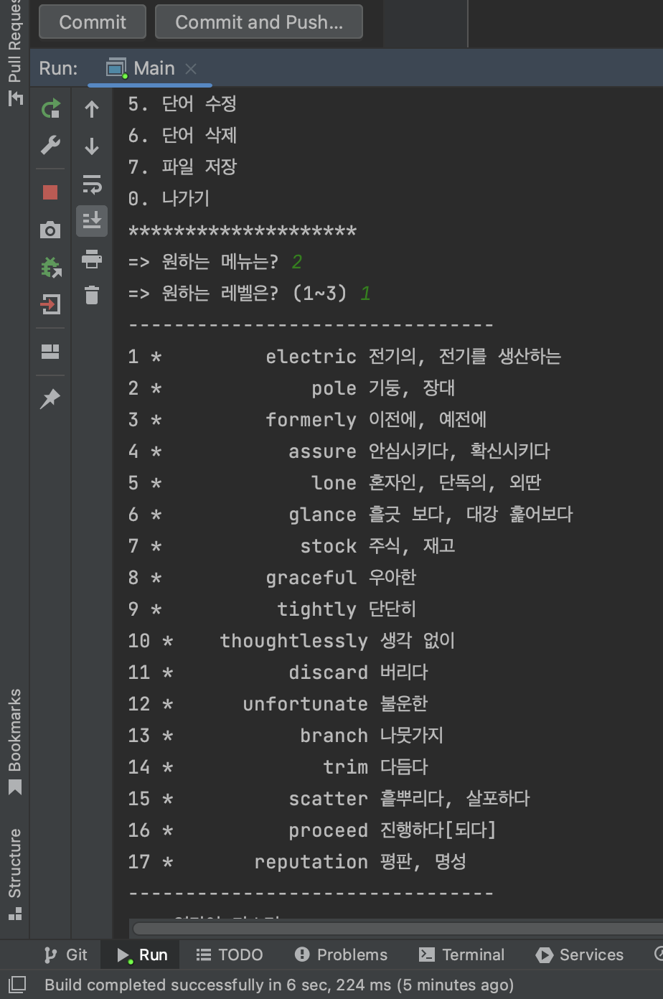
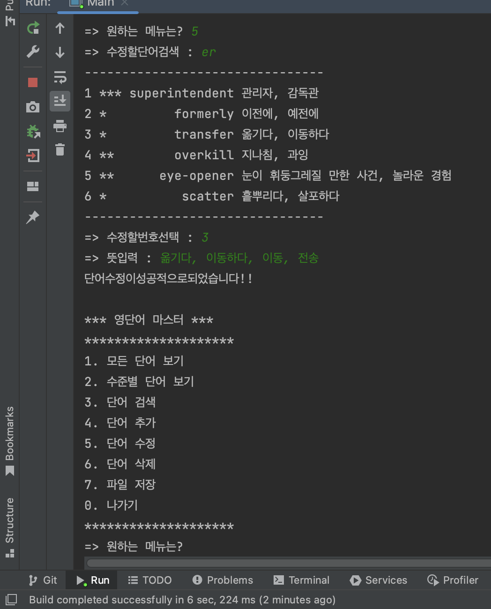
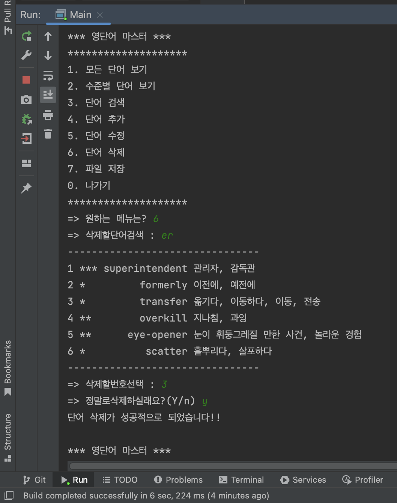
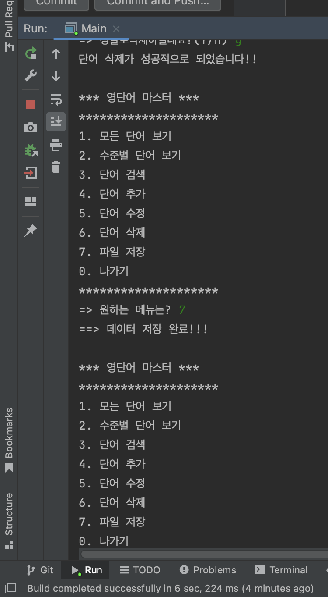

  processing IDE tool & start screen. 

 

  screenshot of menu 1

 

  screenshot of menu 4

 

  screenshot of menu 0

 

  Final Project Report  

  screenshot of menu 2

 

  screenshot of menu 3

 

  screenshot of menu 5

 

  screenshot of menu 6

 

  screenshot of menu 7

 

  screenshot of menu 7

 

  screenshot of menu 7

 

